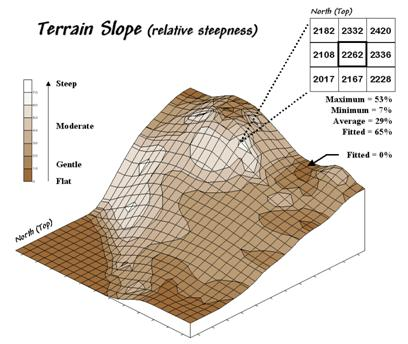
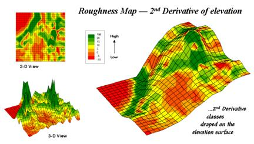
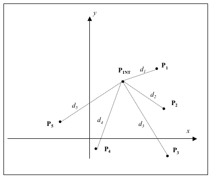

# Capire la geomorfologia

---

### Pendenza

Rappresenta la differenza di quota fra una cella e le celle circostanti

Matematicamente è la derivata prima della superficie

Può essere espressa in gradi (max 90) o in percentuale (100%  = 45°)

---

---

### Esposizione

Orientamento di un versante rispetto al nord

Valori da 0 a 360 in senso orario rispetto al nord

---

### Indici topografici (TRI e TPI)

Misurano la variabilità della superficie

* TRI: differenza media della quota fra una cella e quelle circostanti

* TPI: differenza quota fra cella e media di quelle circostanti

---

### Interpolazione

Da un insieme di punti, stimare zone non campionate

---

### Interpolazione

Esistono tanti modi e tecniche diverse per stimare punti ignoti

---

### Nearest neighbor (vicini più prossimi)

Assegna ad ogni punto il valore del punto campionato più vicino

---

### Nearest neighbor (vicini più prossimi)

Vantaggi:

  - semplice
  - basta la stima in un punto per determinare il poligono

Svantaggi:

  - niente indicazioni sull'errore
  - dimensione e forma regioni dipende fortemente dai campioni

---

### Media mobile

Il valore del punto è dato dalla media dei valori *intorno* al punto di interesse

---

### Inverse distance weight (IDW)

Il valore del punto viene pesato tenendo in considerazione la distanza degli altri punti

Il peso decresce con il quadrato della distanza:

---

### Inverse distance weight (IDW)

Vantaggi:

  - calcolo veloce
  - l'influenza dei campioni è pesata in funzione della distanza

Svantaggi:

  - è sensibile quando punti sono aggregati
  - risente molto di trend globali
