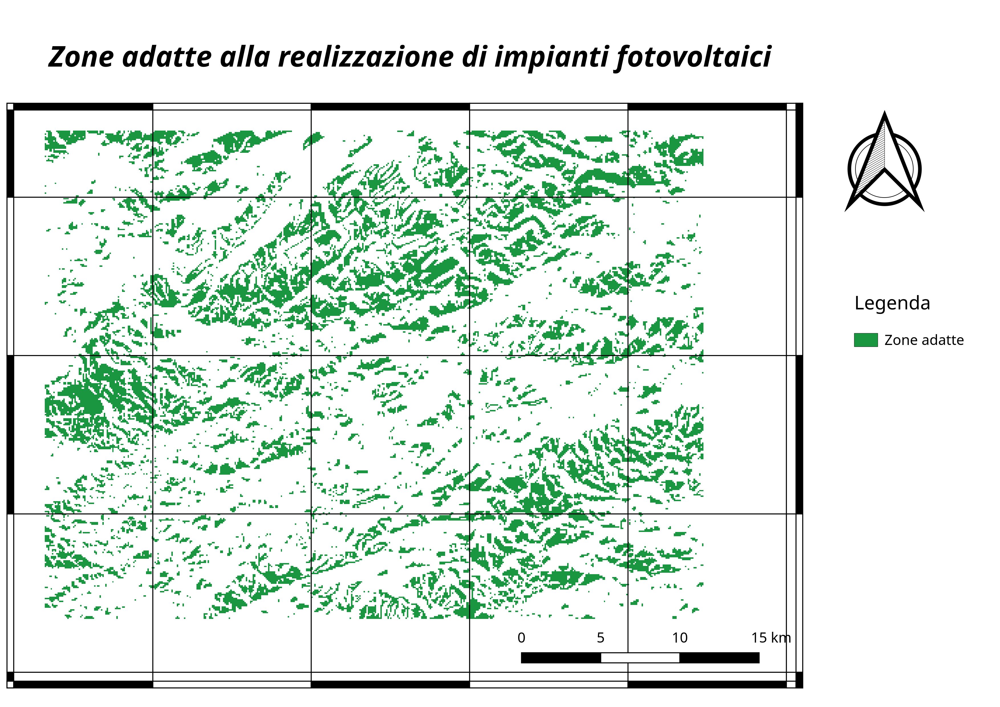

# Test Map Algebra

---

Obiettivo: dato un raster con informazioni sull'altimetria, trovare le zone più
adatte per la costruzione di impianti fotovoltaici

---

Requisiti impianti fotovoltaici:

* zona pianeggiante: **pendenza inferiore a 20 gradi**
* esposizione a sud: **angolo compreso fra 135 e 225 gradi**

---

### Risultato finale

Creazione composizione di stampa con layer risultante tematizzato con scala di
colori a scelta

---

#### Svolgimento (1/5)

1. creare mappa delle pendenze da Processing

2. creare mappa esposizione da Processing

---

#### Svolgimento (2/5)

Utilizzando il Calcolatore raster, estrarre le zone di pendenza inferiori a 20:

    (pendenza@1 < 20)

---

#### Svolgimento (3/5)

Utilizzando il Calcolatore raster, estrarre le zone di esposizione da sud-est a sud-ovest:

    (esposizione@1 >= 135) AND (esposizione@1 <= 225)

---

#### Svolgimento (4/5)

Utilizzando il Calcolatore Raster incrociare i due layer risultanti (pendenza < 20
135 =< esposizione <= 225):

    (pendenza20@1 = 1) AND (esposizionesud@1 = 1)

---

#### Svolgimento (5/5)

Utilizzare il compositore di stampe per produrre la mappa finale

---
