# Geographic Free Open Source Software

---

#### Geographic Informative System

---

#### Geographic Informative System

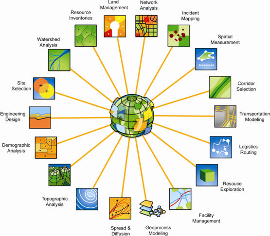

---

#### Geographic Informative System

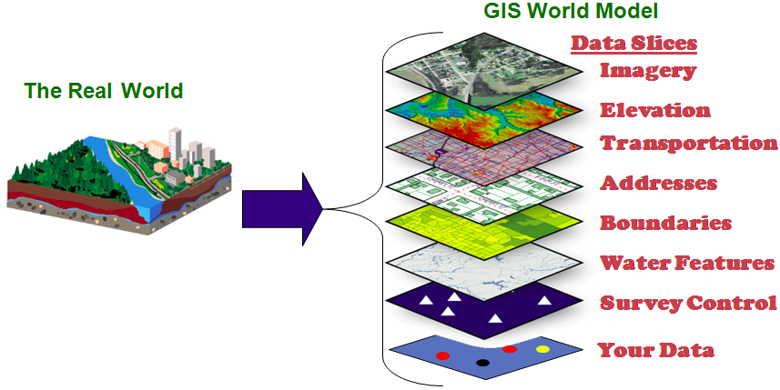

---

#### Dati NON geografici

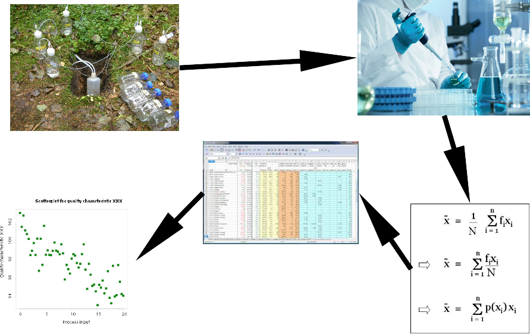

---

#### Aggiunta posizione dati

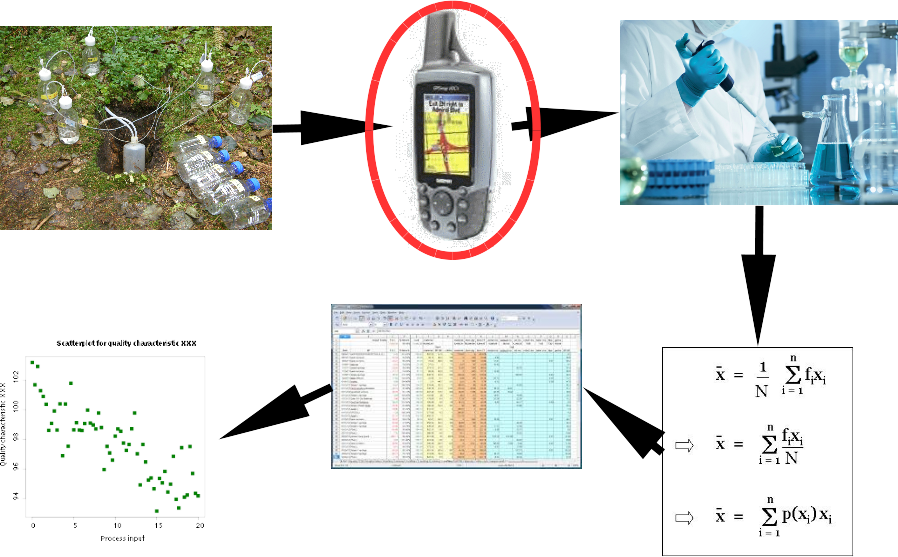

---

#### Dati georeferenziati

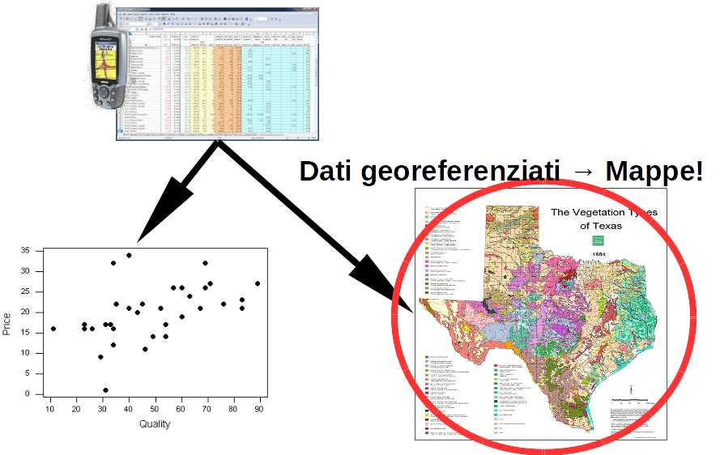

---

#### Elaborazione geografica dati

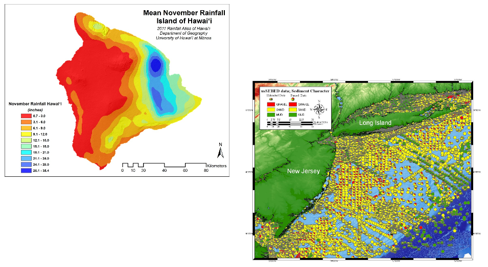

---

### Tipologie dati GIS

* **Vettori** (via OGR)
* **Raster** (via GDAL)
* Database
* Servizi Web (WMS, WFS...)

---

### Vettori e Raster

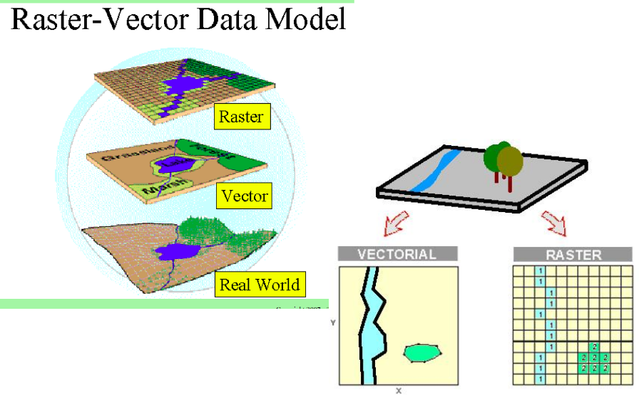

---

### Vettori

* oggetti spaziali definiti da equazioni matematiche <!-- .element: class="fragment" data-fragment-index="1" -->
* 3 tipologie: punti, linee, poligoni <!-- .element: class="fragment" data-fragment-index="2" -->
* indipendenti dalla risoluzione <!-- .element: class="fragment" data-fragment-index="3" -->
* ogni geometria dell'oggetto ha attributi (caratteristiche) <!-- .element: class="fragment" data-fragment-index="4" -->

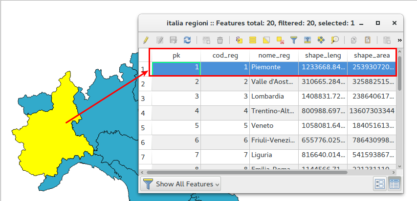 <!-- .element: class="fragment" data-fragment-index="5" style="height:55%;width:55%;"-->

---

### Vettori

<ul>
    <li class="fragment" data-fragment-index="1">formato più diffuso è **ESRI shapefile**</li>
        <ul>
        <li class="fragment" data-fragment-index="2">  almeno 3 file diversi (.shp, .shx, .dbf) </li>
        <li class="fragment" data-fragment-index="3">altri file aggiuntivi (.prj, .cgc, .qpj) </li>
        </ul>
    <li class="fragment" class="fragment" data-fragment-index="4">tanti altri formati disponibili </li>
</ul>

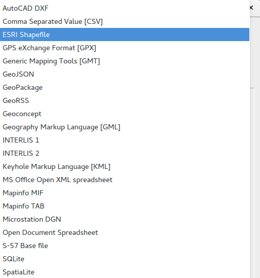 <!-- .element: class="fragment" data-fragment-index="5" style="height:30%;width:30%;"-->
---

### Vettori

#### limitazioni `shapefile` (http://switchfromshapefile.org/)

* **almeno** 3 file
* nome campi limitati a **10 caratteri**
* lunghezza attributi, massimo **255 caratteri**
* tipologia attributi limitata a interi, decimali e testo
* limite dimensione a **2 GB**
* dati **non** topologici
* impossibile risalire a codifica (oggi **quasi** sempre `UTF-8`)

---

### Vettori

#### alternative:

  - Database (PostGIS, SpatiaLite)
  - GeoPackage http://www.geopackage.org/
  - file `gml`, `klm`, `geojson`

---

### Vettori

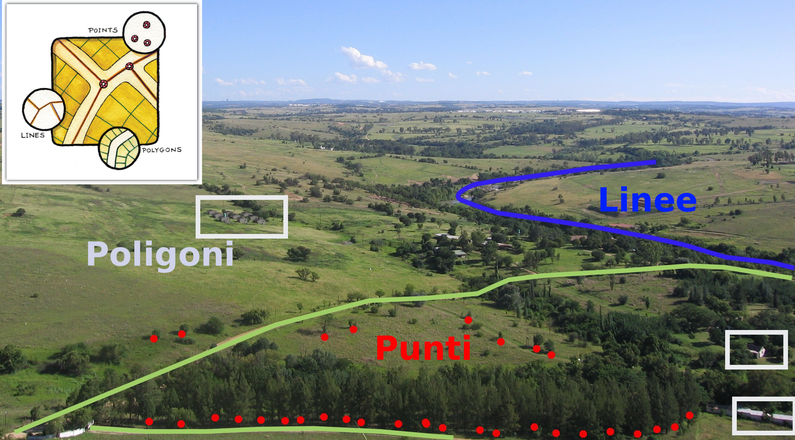

---

### Vettori

Filtraggio della tabella degli attributi

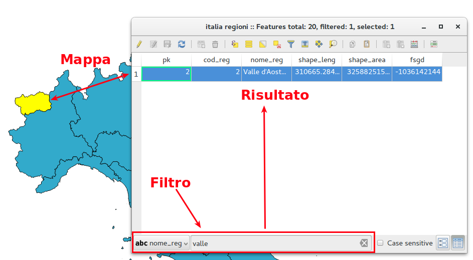

---

### Vettori

Simbologia in funzione degli attributi

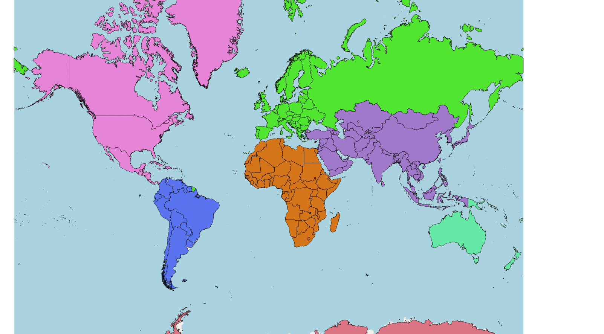

---

### Vettori

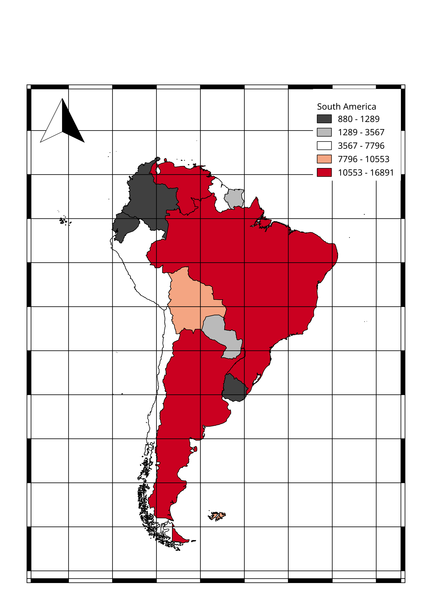 <!-- .element: style="height:40%;width:40%;"-->

---

### Vettori

Digitalizzazione

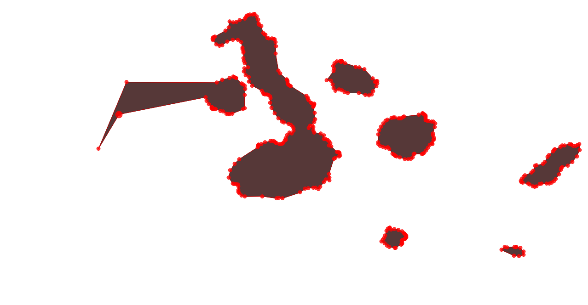

---

### Raster

<ul>
    <li class="fragment" data-fragment-index="1">immagini vere e proprie</li>
    <li class="fragment" data-fragment-index="2">dipendenti dalla risoluzione</li>
    <li class="fragment" data-fragment-index="3">singolo pixel ha informazione numerica (matrice)</li>
    <li class="fragment" class="fragment" data-fragment-index="4">elevazione terreno, concentrazione inquinanti</li>
    <li class="fragment" class="fragment" data-fragment-index="5">adatti per informazioni continue nello spazio</li>
    <li class="fragment" class="fragment" data-fragment-index="6">tantissimi formati: jpeg, png, tiff, geotiff...</li>
</ul>

---

### Raster

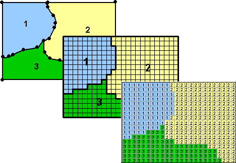

---

### Raster

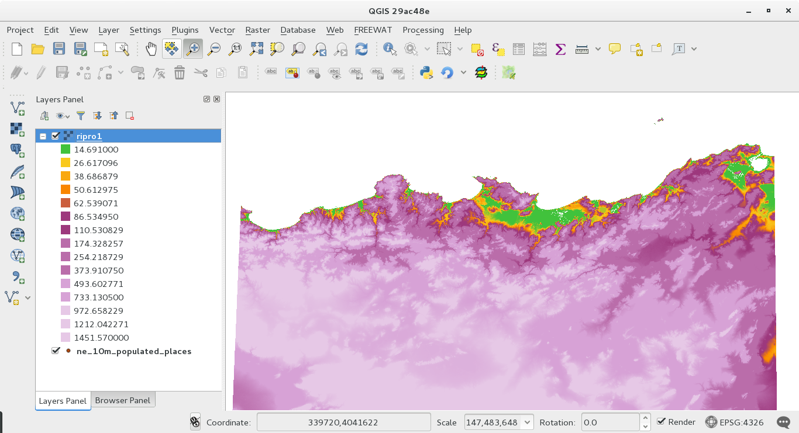

---

### Raster

Map Algebra

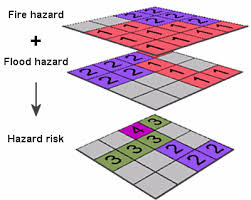

---

### Vettori o Raster?

<ul>
    <li class="fragment" data-fragment-index="1">dati **complementari e non esclusivi**</li>
    <li class="fragment" data-fragment-index="2"> vettori per info **puntuali**</li>
    <li class="fragment" data-fragment-index="3">raster per informazioni **distribuite**</li>
    <li class="fragment" class="fragment" data-fragment-index="4">trasformazione da un formato all'altro</li>
</ul>

 <!-- .element: class="fragment" data-fragment-index="5" style="height:30%;width:30%;"-->
