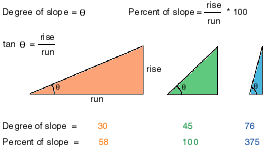
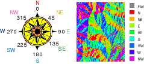

# Capire la geomorfologia

---

### Pendenza

Rappresenta la differenza di quota fra una cella e le celle circostanti

Matematicamente è la derivata prima della superficie

---

### Esposizione

Orientamento di un versante rispetto al nord

Valori da 0 a 360 in senso orario rispetto al nord

