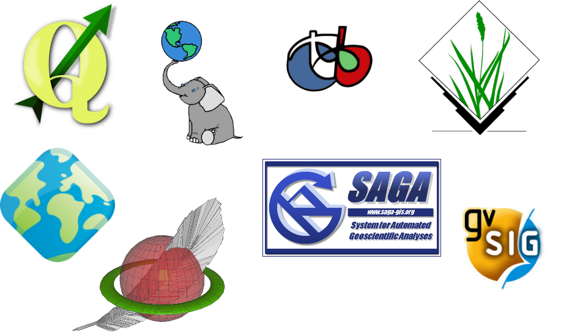
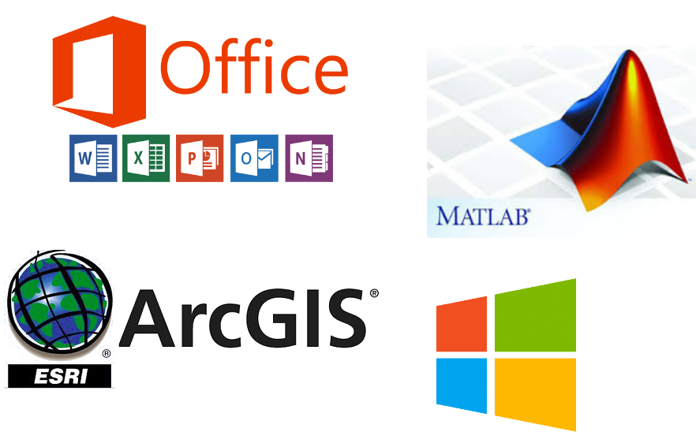

# Geographic Free Open Source Software

---
## QGIS

* creato nel 2002 in Alaska
* ad oggi più di 40.000 modifiche di codice (giornaliere)
* più di 200 sviluppatore (nessuno pagato da QGIS)
* codice robusto
* comunità molto attiva e *sana*

---

## Perché QGIS

* GIS open source più utilizzato nel mondo (in crescita)
* richiesto da pubblici e aziende (è standard)
* enorme support di file
* multipiattaforma (Win, OSX e Linux)
* espandibile con l'uso di plugin
* integrazione con molti altri Software

---

## Open source

### Vantaggi

* codice sorgente **libero**
* aggiornamenti rapidi
* velocità risoluzione problemi (chiunque può)
* comunità molto attive
* personalizzabile a piacimento
* ottima compatibilità

---

## Open source

### Svantaggi

* comunemente demonizzati (gratis = scarso)
* molti sono *giovani*

---
## Open source noti

---

## Open source geografici

---

## Closed source

### Vantaggi

* molto diffusi
* arrivati molto tempo fa sul mercato

---

## Closed source

### Svantaggi

* **prigionia** di decisioni altrui
* costi molto elevati
* mantenimento nel tempo costoso
* personalizzazione difficle
* codice chiuso a chiunque

---

## Closed source

---

## QGIS vs ArcGIS

| QGIS                        | ArcGIS                   |
|-----------------------------|--------------------------|
| Simbologia enorme           | Dati inclusi             |
| Plugin esterni              | Statistiche su file      |
| Modellatore algoritmi       | Parziale supporto 3D     |
| Creazione stampe            | Documentazione           |
| Web Mapping e QGIS server   | Versione base **3000 €** |
| Integrazione altri software |                          |
| **0€** (ma investire!)      |

---

## Come supportare QGIS

* QGIS è mantenuto da *volontari*
* altri modi per collaborare al progetto:

    * sponsor
    * traduzione (interfaccia, manuale, sito)
    * creazione codice e bug fixing

---

## Risorse utili

* guida utente (manuale), training manual, introduzione GIS [http://docs.qgis.org/2.18/it/docs/](http://docs.qgis.org/2.18/it/docs/)

* codice sorgente pubblico [https://github.com/qgis/QGIS](https://github.com/qgis/QGIS)

* altri tutorial [http://www.qgistutorials.com/it/](http://www.qgistutorials.com/it/)

* matteo.ghetta@gmail.com
