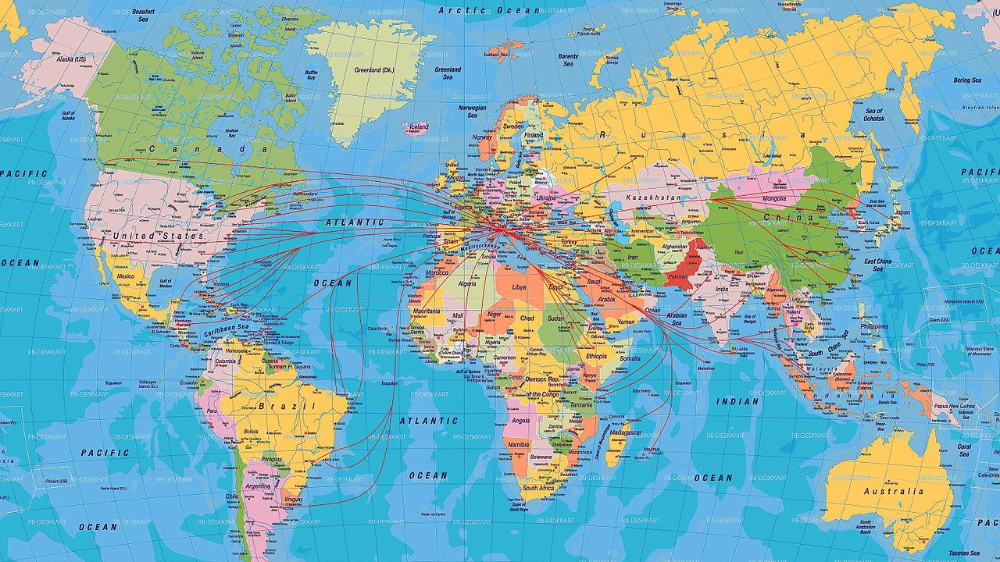

# Geographic Free Open Source Software

---

## Proiezioni

---

## Proiezioni

### Geoide

* solido che meglio rappresenta la Terra
* superficie equipotenziale
* equazioni molto complesse

 <!-- .element: class="fragment" data-fragment-index="1" style="height:30%;width:30%;"-->

---

## Proiezioni

### Ellissoide

* solido che meglio **approssima** la Terra
* equazioni note

 <!-- .element: class="fragment" data-fragment-index="1" style="height:30%;width:30%;"-->

---

## Proiezioni

---

## Proiezioni

### Localizzare oggetti nello spazio

 <!-- .element: style="height:40%;width:40%;"-->

---

## Proiezioni

### Sistemi di riferimento

* Modo arbitrario di localizzare oggetto

---

## Sistemi di riferimento geografici

<ul>
    <li class="fragment" data-fragment-index="1">uso frequente (GPS)</li>
    <li class="fragment" data-fragment-index="2">misure come angoli rispetto a ellissoide</li>
        <ul>
        <li class="fragment" data-fragment-index="3">rispetto a meridiano e parallelo di riferimento</li>
        <li class="fragment" data-fragment-index="4">Greenwich e Equatore</li>
        </ul>
    <li class="fragment" data-fragment-index="5">WGS84 ellissoide più comune</li>
</ul>

---

## Sistemi di riferimento geografici

---

## Sistemi di riferimento geografici

* distanza **angolare**
* coordinate in gradi, primi, secondi oppure gradi decimali..
* 42°13'56” (gradi primi secondi)
* 43.648 (gradi decimali)

---

## Sistemi di riferimento proiettati

<ul>
    <li class="fragment" data-fragment-index="1">rappresentazione Terra (3D) su piano (2D)</li>
    <li class="fragment" data-fragment-index="2">distanze **metriche** </li>
    <li class="fragment" data-fragment-index="3">coordinate **metriche** (N4700567, E350657)</li>
</ul>

 <!-- .element: class="fragment" data-fragment-index="4" style="height:50%;width:50%;"-->

---

## Sistemi di riferimento proiettati

Proiezioni diverse per scopi diversi (aree, distanze...)

 <!-- .element: class="fragment" data-fragment-index="4" style="height:40%;width:40%;"-->

---

## Sistemi di riferimento proiettati

<ul>
    <li class="fragment" data-fragment-index="1">non basta ellissoide, serve **DATUM**</li>
        <ul>
        <li class="fragment" data-fragment-index="2">ellissoide di riferimento</li>
        <li class="fragment" data-fragment-index="3">tipo di proiezione</li>
        </ul>
    <li class="fragment" data-fragment-index="4">distorsioni minori se locale</li>
</ul>

 <!-- .element: class="fragment" data-fragment-index="4" style="height:40%;width:40%;"-->

---

## Sistemi di riferimento proiettati WGS84 - UTM

<ul>
    <li class="fragment" data-fragment-index="1">proiezione maggiormente diffusa (scala globale)</li>
    <li class="fragment" data-fragment-index="2">Terra divisa in **60 fusi** </li>
    <li class="fragment" data-fragment-index="3">gradi distorsioni a latitudini elevate</li>
</ul>

 <!-- .element: class="fragment" data-fragment-index="4" style="height:60%;width:60%;"-->
---

## True size of the Earth

---

## True size of the Earth

[true size](https://thetruesize.com/#?borders=1~!MTY0MjQzNjY.NDU5OTYxOA*MzU3MDExNzI(MjE5NzI2Ng~!GL*OTYyOTE4Nw.MjkyNzU4MzY)

---

## Sistemi di riferimento proiettati in Italia

<ul>
    <li class="fragment" data-fragment-index="1">Gauss-Boaga (fuso est e ovest) (EPSG 3003, 3004)</li>
    <li class="fragment" data-fragment-index="2">Cassini Soldner (EPSG 9806) </li>
    <li class="fragment" data-fragment-index="3">UTM- WGS84 (EPSG 32632, 32633)</li>
    <li class="fragment" data-fragment-index="4">UTM-ED50 (EPSG 23032, 23033)</li>
    <li class="fragment" data-fragment-index="5">UTM-ETRS (EPSG 25832, 25833)</li>
    <li class="fragment" data-fragment-index="6">WGS84 (geografico) (EPSG 4326) </li>
</ul>

---
## Sistemi di riferimento proiettati in Italia

 <!-- .element: style="height:60%;width:60%;"-->
---

## Codici EPSG

* codificazione migliaia di sistemi di riferimento
* codice univoco e universale
* molti siti in cui trovare informazioni

 <!-- .element: style="height:60%;width:60%;"-->
