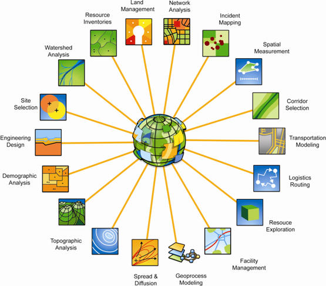
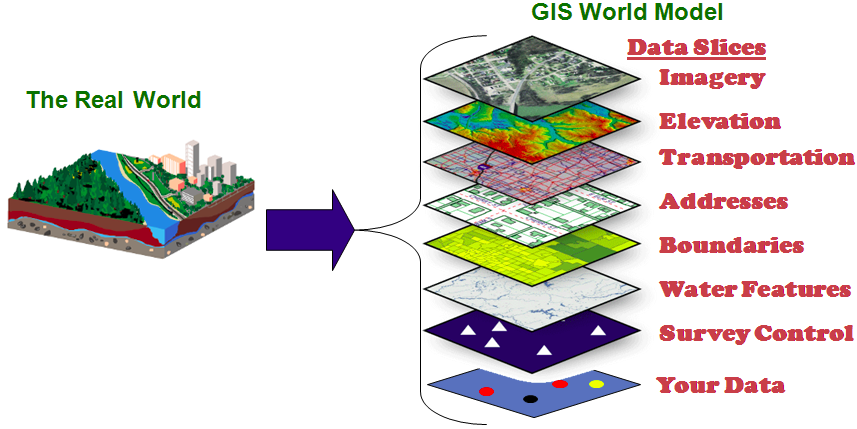

====================================
Sistemi Informativi Geografici (GIS)
====================================

I GIS sono sistemi di analisi molto complessa usata in moltissimi ambiti diversi:

* ecologia
* geologia
* urbanistica
* biologia
* scienze ambientali
* ...

Il flusso di lavoro è molto semplice:

* si raccolgono i dati
* questi vengono elaborati dentro un GIS
* si fanno analisi tematiche e statistiche
* conclusione in base all'analisi numerica e visiva
* creazione di mappe tematiche

QGIS
====
`QGIS`_ è un software completamente open sorce mantenuto da un pugno di volontari.
Esiste da svariati anni e, dal rilacio della versione 2.0 (settembre 2.0), è diventato il GIS open source più utilizzato al mondo `*`_.

Moltissime istituzioni pubbliche e private lo utilizzano abitualmente: molto spesso queste image hanno rinunciato ad altri software open source (validi ma meno mantenuti o complicati da utilizzare) oppure al rinomatissimo ArcGIS risparmiando sui costi di licenza (circa 3000€ per versione di base `**`_).

**Perchè QGIS?**

* utilizzatissimo e richiesto da moltissimi (aziende private e amministrazioni pubbliche)
* dinamico e con un costante mantenimento
* open source (versatile, personalizzabile)
* veloce in moltissime operazioni (quasi sempre più veloce di ArcGIS)
* multipiattaforma (Win, Mac e Linux)
* disponibile in moltissime lingue
* versioni stabili rilsciate ogni 4 mesi, versione *LTR* e versioni di sviluppo
* espandibile con centinaia di *plugin*
* completa integrazione con altri software GIS e non in un unico ambiente grafico(SAGA, OTB, GRASS, R)
* utilizzo di solide librerie per gli algoritmi geografici
* programmabilità e console **python** (per esperti)

**Perchè open source?**

Usare un software open source è meglio per una lunga serie di motivi:

* etici, non si è più legati a un *monopolio*
* economici: scaricabili gratuitamente e con piccole donazioni da parte di ognuno è garantito il funzionamento
* libertà di configurazione
* libertà di adattamento alle proprie esigenze
* integrazione garantita con altri software open source (100%) e non
* dinamicità e rapidi aggiornamenti in caso di errori
* interfaccia **diretta** con chi sviluppa il software

Come contrubuire a QGIS
=======================
Ci sono molti modi diversi:

* contributo `economico <http://qgis.org/it/site/getinvolved/donations.html>`_
* aiuto nella programmazione
* aiuto nella `traduzione <http://qgis.org/it/site/getinvolved/index.html#translate>`_
* segnalazione *bug* (malfunzionamento)

Come si segnala un *bug*?
-------------------------
Direttamente nel `portale`_. Dopo una rapida (e gratuita) iscrizione si può segnalare il malfunzionamento.

Comunità di supporto
--------------------
In Italia:

* `GFOSS`_ associazione per l'informazione geografica libera
* `qgis.it`_ gruppo utenti italiani di QGIS

.. _QGIS: http://www.qgis.org/it/site
.. _*: http://www.google.it/trends/explore#geo&q=qgis,+grass+gis,+gvsig,+saga+gis&cmpt=q
.. _**: http://www.geographics.it/contenuti/estratto-listino-arcgis
.. _portale: http://hub.qgis.org/projects/quantum-gis
.. _GFOSS: http://www.gfoss.it
.. _qgis.it: http://www.qgis.it
