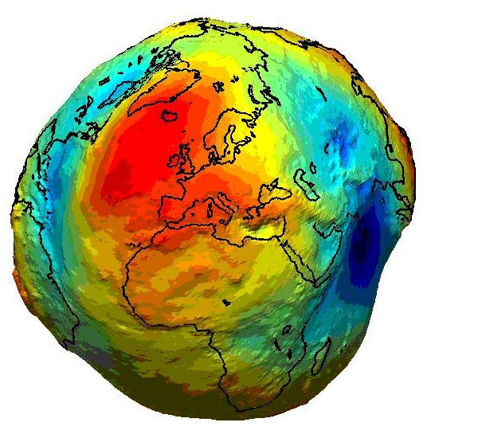
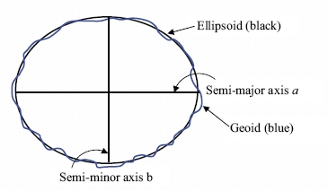
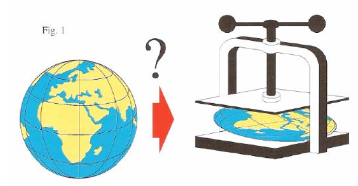
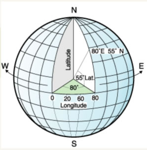
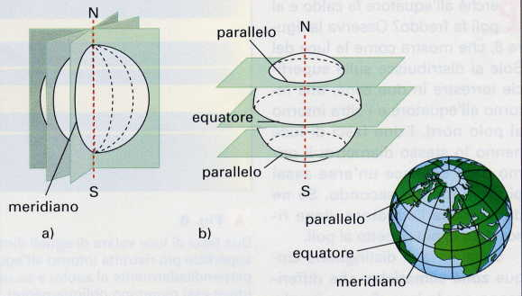
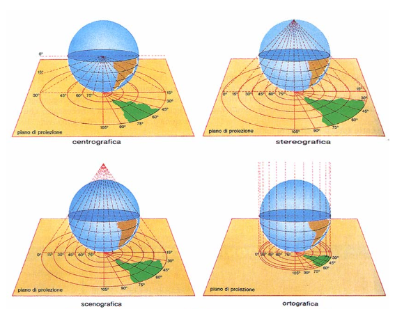
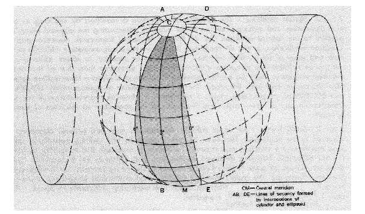
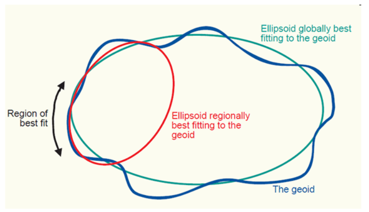

==========
Proiezioni
==========
Agli inizi della cartografia il problema principale era quello di trovare un solido che rappresentasse la forma della Terra.
Si è arrivati a definire il **geoide**, ovvero un solido la cui superficie rappresenta un campo gravitazione equipotenziale:

Vista la difficoltà di utilizzo di un geoide (le equazioni matematiche che lo descrivono sono molto complesse), si usa un solido più semplice e che si avvicina molto alla forma della Terra, l'**ellissoide**:

Un altro enorme problema è quello di rappresentare la superficie terrestre su un piano; infatti non è possibile *schiacciare* una sfera e un'operazione di questo tipo comporta inevitabilmente delle deformazioni.

Il problema fondamentale quindi è quello di posizionare un oggetto nello spazio, ma in uno spazio preciso!
Attraverso l'uso delle coordinate è possibile definire in maniera univoca la posizione di un oggetto.
Si, ma rispetto a che cosa?

Entrano cosi in gioco i **sistemi di riferimento**, ovvero un metodo per indicare la posizione rispetto a dei punti noti.

Esistono due grandi famiglie di sistemi di riferimento di coordinate:

* **Geografici**
* **Chilometrici** o **Proiettati**

Sistema di riferimento geografico
=================================
L'uso di questi sistemi è molto frequente. Ogni punto è descritto da una **latitudine** e una **longitudine** (occasionalmente anche da una quota).
Questo modo di identificare un oggetto è relativamente semplice: infatti sono le misure degli angoli di quell'oggetto rispetto all'ellissoide di riferimento:

.. note:: ci sono decine di ellissoidi, quindi è importante comunicare a quale si sta facendo riferimento.

Le misure di questi angoli si riferiscono a un parallelo e a un meridiano di riferimento, **equatore** e **Greenwich**:

Quindi in poche parole, un sistema di riferimento geografico permette di identificare la posizione di un oggetto in funzione della sua distanza angolare rispetto all'equatore al meridiano centrale di Greenwich.

Visto che la posizione è misurata in angoli, le **coordinate** saranno espresse in **gradi** o sue frazioni:

* 12° 13' 14" (DMS)
* 12° 13,4' (DM)
* 45,21° (DD)

L'ellissoide maggiormente utilizzato (GPS, Google, Wikipedia, ecc...) è il **WGS84**, un ellissoide geocentrico, ovvero il cui centro corrisponde con il centro della Terra.

Sistema di riferimento chilometrico
===================================
Questo tipo di sistema di riferimento permette di rappresentare sul piano una porzione della superficie terrestre. Quindi ci permette di calcolare effettivamente le distanze metriche fra due punti proprio perché la superficie della Terra è ora proiettata su un piano bi-dimensionale.

Il metodo prende il nome di **proiezioni**:

Una proiezioni largamente utilizzata è la **UTM** (Universal transverse Mercator):

In pratica, una volta deciso l'ellissodie da usare per rappresentare la Terra, questo viene avvolto in un cilindro il cui lato maggiore è tangente all'equatore.

Fatto questo, è possibile *proiettare* la Terra su un piano e *srotolare* il cilindro.
Per limitare le deformazioni la superficie viene divisa in 60 "spicchi" chiamati **fusi**, ognuno largo 6° e numerati in modo crescente a partire dall'**antimeridiano** di Greenwich.
Nel sistema UTM l'Italia ricade nei fusi 32, 33 e 34.

La Terra è divisa anche in senso longitudinale in 20 fasce (T se a Nord dell'equatore, S se a sud).

Per identificare un sistema di riferimento è quindi necessario richiamare il **Datum**. Il **Datum** è l'insieme di tutte le informazioni della proiezione che abbiamo usato: tipo di ellissoide, localizzazione e centramento dell'ellissoide e tipo di proiezione. Per esempio UTM-WGS84, UTM-ED50,...

.. note:: conoscendo i sistemi di riferimento si possono convertire i dati senza problemi (semplici operazioni matematiche)

Codici EPSG
-----------
Per limitare le deformazioni e approssimare al meglio le distanze, praticamente ogni nazione ha il proprio sistema di riferimento. Molto spesso anche più di uno.

Vista la moltitudine di sistemi di riferimento (QGIS ne supporta quasi 3000), è stato necessario assegnare un codice univoco a ciascuno di essi per poterli identificare semplicemente.

La `Europen Petroleum Survey Group <http://www.epsg-registry.org/>`_ cataloga e definisce i sistemi di riferimento descrivendoli e accompagnadoli a un codice identificativo **EPSG**.

Sistemi usati in Italia
-----------------------
Dal momento che la distorsione è tanto maggiore quanto maggiore è la superficie della Terra interessata, col tempo ogni Stato ha adottato un proprio sistema di riferimento centrando l'ellissoide nel proprio territorio in modo da minimizzare gli errori.

Lista di sistemi maggiormente utilizzati:

* Gauss-Boaga (fuso est e ovest) (EPSG 3003, 3004)
* Cassini Soldner (EPSG 9806)
* UTM- WGS84 (EPSG 32632, 32633)
* UTM-ED50 (EPSG 23032, 23033)
* UTM-ETRS (EPSG 25832, 25833)
* WGS84 (geografico) (EPSG 4326)

.. note:: è fondamentale per ogni dato geografico che si vuole caricare, che questo sia accompagnato dalla sua informazione spaziale. Se questa informazione manca, si rischia di fare delle analisi sbagliate.
