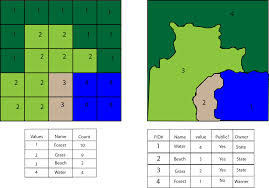
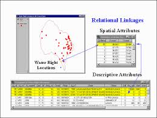
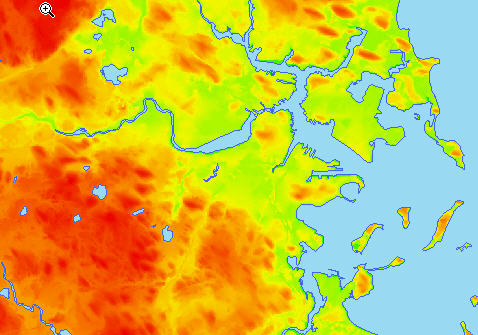
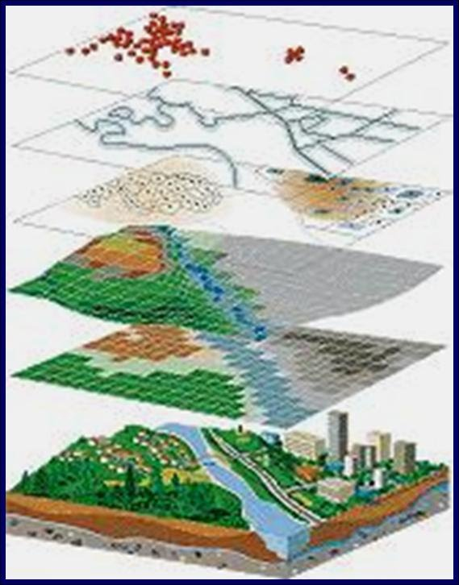

==============
Tipologie dati
==============
Esistono due grandi categorie di dati:

* vettori (punti, linee, poligoni)
* raster (../immagini)

Un vettore è una figura descritta da precise equazioni matematiche, infatti non ha problemi di qualità quando ridimensionato.
Un raster è un'immagine, quindi una matrice in cui ogni cella ha una particolare informazione:

    vector & raster

Vettori
=======
Un layer vettoriale rappresenta la realtà attraverso delle **geometrie** quindi attraverso delle **formule matematiche** per precise.
Proprio per questo motivo non soffrono del problema della risoluzione.

Queste geometrie sono essenzialmente di 3 tipi:

* punti
* linee
* poligoni

Ogni vettore è accompagnata da una **tabella degli attributi**, ovvero un database di informazioni su quella geometria. Es. punto che rappresenta una albero, la tabella può contenere delle informazioni riguardandi:

* coordinate
* tipologia di albero
* altezza
* potatura
* ecc...

    vector

Un formato molto comune per i vettori è lo **ESRI shapefile**.
Un vettore codificato in shapefile è composto da **almeno** 3 file:

* vettore.shp (informazioni sulla forma)
* vettore.dbf (database degli attributi)
* vettore.shx (collega le geometrie agli attributi)

Spesso troviamo anche altri file:

* vettore.prj (informazioni sulla proiezione) --> **fondamentale per informazioni sulla localizzazione**
* vettore.cpg (informazioni sulla codifica)
* vettore.qpj (informazioni sulla proiezione scritti da QGIS)

.. note:: il file :file:`dbf` si può tranquillamente aprire con gestori di fogli elettronici (Excel, Libreoffice). Tuttavia è sconsigliatissimo correggere o aggiungere dei valori in questo modo, un piccolo errore e il file risulterà corrotto.

Il formato shapefile non è l'unico disponibile, ma semplicemente il più utilizzato.
Ha diverse limitazioni:

* campo tabella dbf può contenere al max 10 caratteri
* non si possono memorizzare valori nulli. Se il dato manca viene assegnato automaticamente il valore 0
* campi di testo al massimo 255 caratteri
* se ci sono tante geometrie, la risposta del file rallenta considerevolmente
* problemi di codifica
* ogni shapefile ha almeno 3 file
* moltiplicazione durante il flusso di lavoro

Alternative allo shapefile sono i **geo database**, PostGIS (interfaccia client-server) e SpatiaLite (unico file per n shapefile).
Un po' più complessi da utilizzare all'inizio sono molto comodi, pratici e veloci.

Ci sono davvero decine di tipi di file vettoriali diversi:

* GML
* KML
* GeoJSON
* ...

Raster
======
I raster sono delle ../immagini, ovvero delle matrici con informazioni numerica per ogni cella (pixel).
Maggiore è il numero di pixel (risoluzione) e maggiore è il dettaglio delle informazioni.

Un raster contiene un'unica informazione (a differenza dei vettori).

Tipico esempio di raster sono i DEM (Digital Elevation Models) dove a ogni pixel è associata l'informazione della quota:

    raster

Come per i vettori, anche per i raster esistono decine e decine di formati diversi:

* TIFF - GEOTIFF
* JPEG
* PNG
* BITMAP
* ...

Ognuno con pregi e difetti. Alcuni puntano a comprimere i dati per occupare meno spazio su disco, perdendo qualità. Alti incorporano direttamente le informazioni di localizzazione senza bisogno di altri file aggiuntivi.

Vettore o raster?
=================
Vettori e raster sono dati complementari e non esclusivi, cioè integrando queste due tipologie di dato si potrà fare un'analisi completa e accurata:

* vettori sono ideali per informazioni non continue (singolo albero)
* raster sono utili per descrivere informazioni continue nello spazio (distesa erbosa)

Integrando entrambi i dati si ottiene una mappa completa:

