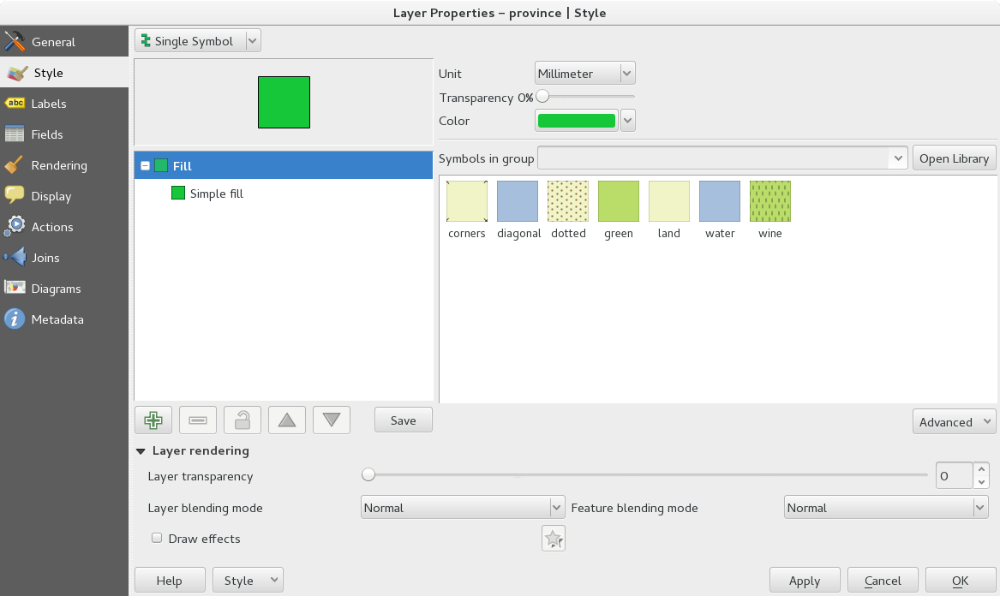
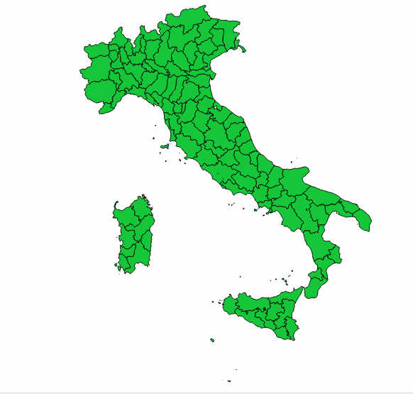
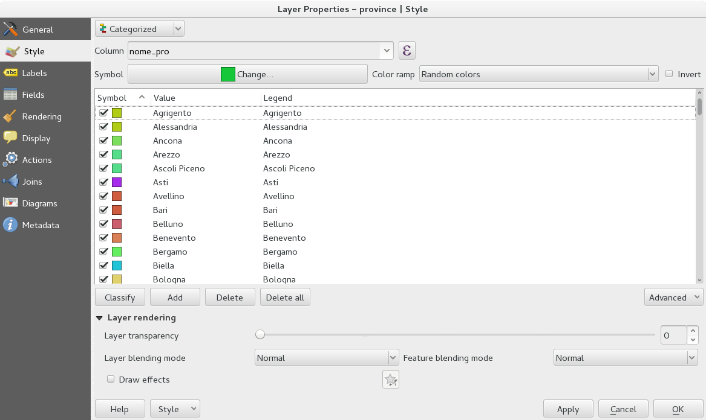
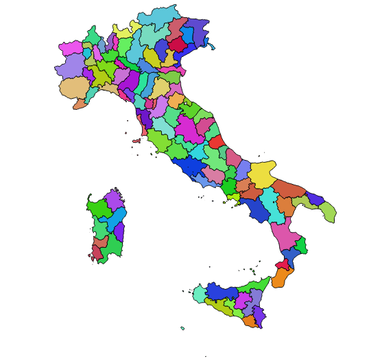
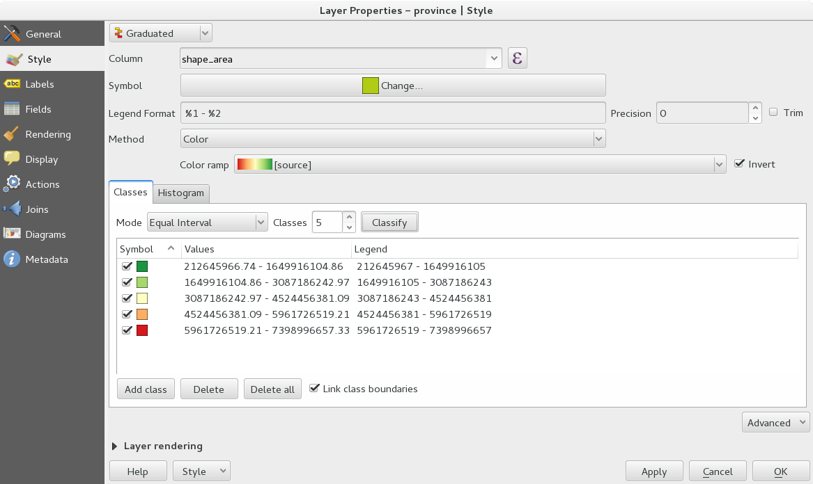
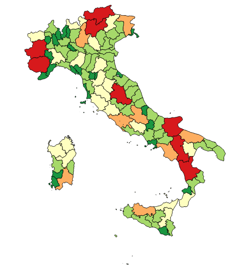
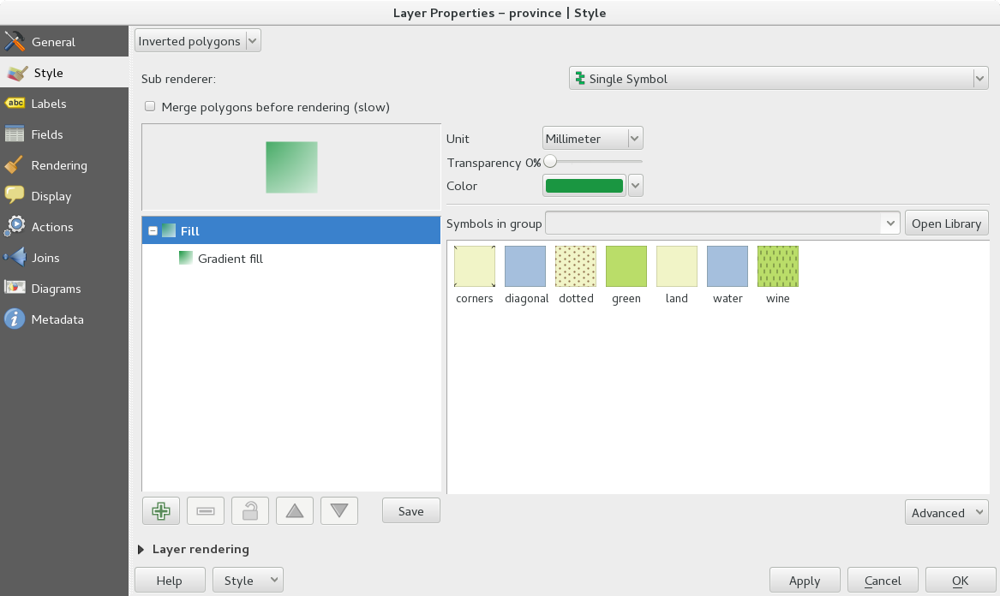
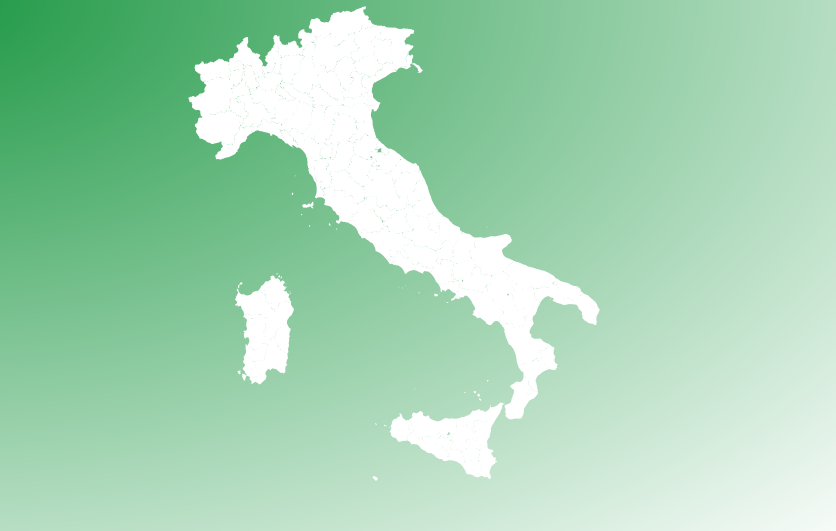

=====
Stili
=====
Ogni vettore può essere stilizzato in funzione degli attributi che ha.

Simbolo singolo
---------------
Ogni geometria ha lo stesso colore, in pratica non viene assegnato un colore in funzione di nessun attributo. È una semplice visualizzazione dell'oggetto.
Ci sono molti tipi di simboli diversi (riempimento semplice, puntuale, solo contorni, ecc...).

Categorizzato
-------------
L'oggetto viene classificato a seconda di un attributo presente nel database, esempio un colore diverso per ogni comune.
Si possono scegliere colori casuali o scale di colori predefinite.
In aggiunta è possibile anche creare una scala personalizzata o caricarne molte altre.

Graduato
--------
Viene assegnata una scala di colori in funzione di un attributo **numerico** del vettore, per esempio la superficie di ogni geometria.
Oltre alla scelta della scala di colori è possibile scegliere il numero delle classi e il metodo di classificazione:

* Intervallo uguale: classi di uguale ampiezza (non importa quante geometrie facciano parte di ogni classe). Utile quando la variabilità dei dati è bassa
* Quantile: divide in classi in modo che per ogni classe ci sia lo stesso numero di elementi.
* Natual breaks (Jenks): lo scopo è quello di minimizzare le differenze all'interno di ogni classe e massimizzando quelle fra le classi
* Deviazione standard: i valori degli elementi sono suddivisi in base alla dispersione rispetto alla media totale. Man mano che le classi aumentano, aumenta anche la differenza degli elementi rispetto al valore medio
* Pretty breaks: genera dei gruppi con valori progressivi secondo andamento esponenziale

Poligoni invertiti
------------------
Lo stile scelto cadrà al di fuori del poligono. Utile se usato con simbolo singolo e qualche sfumatura.

