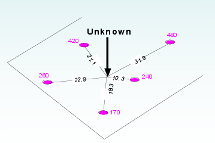
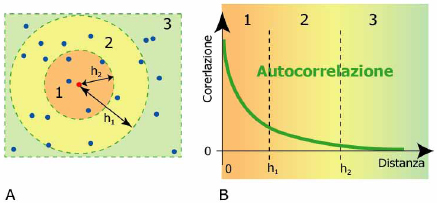
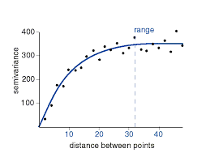

=============
Geostatistica
=============
La geostatistica è quella branca della statistica che si occupa dell'analisi e interpretazione di dati geografici.

* Come varia una variabile nello spazio?
* Che cosa controlla la sua variazione nello spazio?
* Quali e quanti campioni sono necessari per descrivere la sua variabilità spaziale?
* Qual è il valore della variabile in una specifica posizione (predizione)?
* Qual è l’incertezza di questa stima?

Sono dovuti passare molti anni prima che la geostatistica venisse applicata anche ad altri settore oltre a quello di esplorazione mineraria e petrolifera

* rappresentazione matematica complessa
* nessun sotware GIS fino agli anni '90
* costi dei software molto elevati

L’ambiente è un dominio continuo nelle tre dimensioni (e anche nel tempo) e possiamo tentare di effettuare misure solamente in un numero finito di siti, non si può pensare di campionare tutti i possibili punti di un'area.

Il compito della geostatistica è queindi quello di **stimare** i valori incogniti di una zona grazie alla conoscenza delle zone circostanti (un po' come di fa con l'inferenza statistica).

Se inizialmente la geostatistica si occupava solamente di resitutire i valori **interpolati** di un'area, la sua evoluzione ha permesso di misurare anche l'**incertezza** del dato.

L'incertezza permette di capire tutti i possibili valori di un punto incognito e non solamente il valore che questo assume dopo un'operazione di interpolazione.

Workflow
========
Un'analisi geostatistica prevede diversi step, ognuno dei quali importante per ottenere risultati spendibili.

1. si inizia con la raccolta dei dati e uno studio preliminare. Con questa prima analisi dei dati si può capire se ci sono valori anomali, valiri ripetuti e se è necessario provvedere a una trasformazione dei dati

2. i dati ora analizzati vengono pre-processati, ovvero viene valutato se togliere dei trend spaziali, se trasformare (normalizzare) la distribuzione dei valori ed effettuare un'analisi cluster per compensare dati di campionamento presi in maniera non ottimale

3. accanto al pre-processamento può essere necessario anche costruire un modello della struttura spaziale dei dati (correlazione spaziale). Alcuni di questi metodi, come il *kriging*, richiedono esplicitamente lo studio della correlazione spaziale (tramite il variogramma) **prima** di essere utilizzati, altri metodi invece, come la *distanza inversa ponderata*, richiedono un semplice parametro di struttura spaziale, ma basato sulla conoscenza a priori del fenomeno

4. in funzione di quanti punti sono disponibili è necessario capire qual è il minimo di questi punti necessario per stimare altri valori. Questo dato è necessario anche per capire il valore di incertezza del modello (usando 1000 punti in una piccola area ho sicuramente un valore di incertezza minore rispetto a 10 punti in un'area più estesa)

5. una volta definiti tutti questi parametri e punti, è possibile inserirli in nel modello. Il risultato finale è di solito una mappa (raster) di valori continui (interpolati). A questo punto è possibile anche investigare eventuali valori anomali perché questi cambiano notevolmente il risultato finale.

Autocorrelazione spaziale
=========================
La prima legge di Tobler dice che tutto è in relazione con tutto, ma oggetti vicini sono più simili di oggetti lontani.
Quindi l'autocorrelazione ci permette di capire una dipendenza spaziale fra le osservazioni.
I valori delle proprietà ambientali ad una certa scala sono positivamente relazionati (autocorrelati).
Punti vicini tra di loro tendono a valori simili, mentre punti lontani differiscono, in media, in misura maggiore.

**La posizione del campione misurato è importante tanto quanto il valore stesso**

Variogramma e semivariogramma
=============================
Nell'analisi spaziale possiamo immaginarci un grafico dove ogni punto, oltre ad avere delle coordinate, ha anche il valore di una variabile (quota, concentrazione di inquinante, porosità del terreno, ecc...).

Come già visto, punti vicini (in media) hanno valori più simili.
Posso fissare un raggio di ricerca intorno ai punti e andare a calcolare la **semi varianza** fra i valori dei punti.
Il grafico che otterrò è chiamato **semi variogramma**: ogni punto rappresenta la sommatoria della semi varianza a certe distanze.

Si vede come la semi varianza aumenti con la distanza, finché non raggiunte un limite in cui non cambia più. Questo valore ci permette di capire qual è la distanza massima entro cui i punti hanno un comportamento simile.
