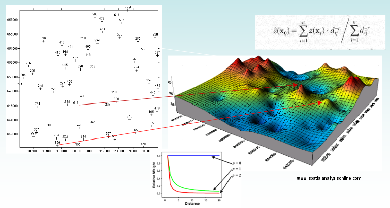
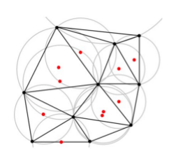
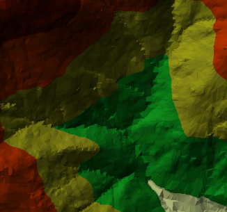
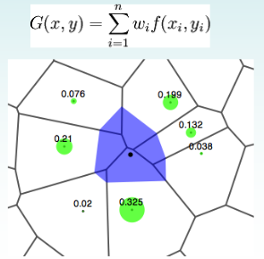
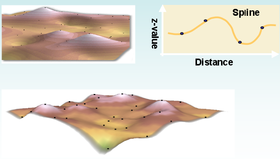
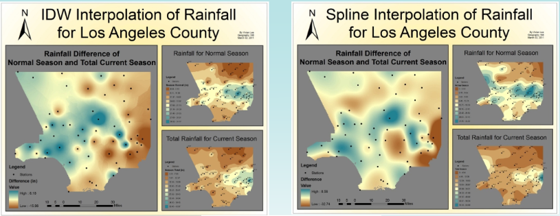

=====================
Metodi deterministici
=====================
IDW
===
Il metodo dell scarto quadratico medio si basa sull'assunto che il peso del dato di input è inversamente proporzionale alla distanza dal valore da stimare.
Questo significa che man mano che ci allontaniamo dalla zona che vogliamo stimare, il peso dei punti vicini perde di importanza.

Un esempio di utilizzo: previsione di acquisti da parte di consumatori. Negozi distanti hanno poca influenza sui compratori, perché questi preferisono comprare vicino casa.

TIN
===
Crea una superficie di triangoli in modo che la circonferenza che passa per i 3 vertici di ogni triangolo non contiene nessun verticie di altri triangoli adiacenti.

Il risultato è un layer irregolare con una serie di triangoli contenenti le informazioni dei dati in input.

Natural neighbour
=================
Tecnica simile a IDW. Si assume infatti che ogni punto abbia una *sfera di influenza* nello spazio circostante. È di fatto una media pesata in cui i pesi sono definiti dalla porzione di area utilizzata di ogni poligono di Voronoi.

Spline
======
Spline esegue una stima dei valori attraverso una funzione matematica (applicata ai dati misurati nel vicinato) che minimizza la curvatura, dando origine ad una superficie molto smussata (simula uno strato di gomma che si conforma ai dati di input).
Dal momento che è una tecnica **non lineare** ed esatta, è molto adatta a superfici con una variabilità debole (temperature, superfici piezometriche, concentrazioni di inquinanti...).

Moving average
==============
Il valore ignoto è pari alla media aritmetica dei valori rilevati in un numero predefinito nell'intorno (i 2 più vicini, i 3 più vicini, ecc...).

Nearest neighbor
================
La variabili ignota prende il valore del punto più vicino. Molto semplice, ma può causare errori anche grossolani.
