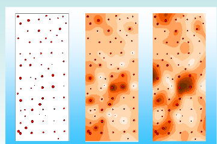
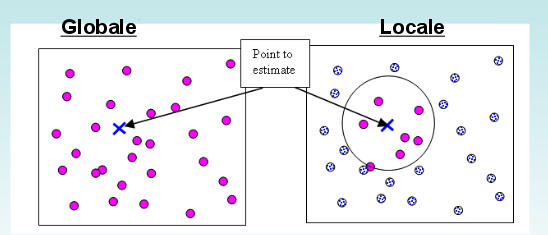

==============
Interpolazione
==============
L'interpolazione è una tecnica che permette di stimare il valore di una variabile grazie a dei valori campionari.

Esistono due grandi famiglie di metodi di interpolazione:

1. metodi **deterministici** (IDW, Media mobile,....)
2. metodi **geostatistici** (kriging)

I metodi **deterministici** creano superfici a partire da punti misurati basandosi su un cristerio di similarità spaziale (IDW) o su un grado di *lisciatura* (funzioni radiali di base).

I metodi **geostatistici** creano superfici che hanno tutte le proprietà statistiche dei dati di partenza. Oltre a stimare i valori, queste tecniche danno anche una stima dell'errore.

Esistono molte molte tecniche diverse di interpolazione che danno risultati diversi.
Non è facile capire quale tecnica usare, dipende molto dalla zona di interesse.

Durante una interpolazione si può prevedere un raggio globale o locale attraverso qui ricercare i risultati da stimare.

http://desktop.arcgis.com/en/arcmap/latest/extensions/geostatistical-analyst/classification-trees-of-the-interpolation-methods-offered-in-geostatistical-analyst.htm
