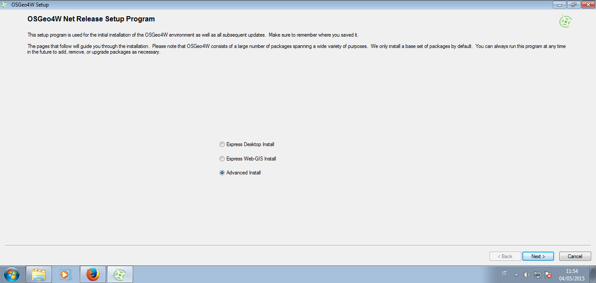
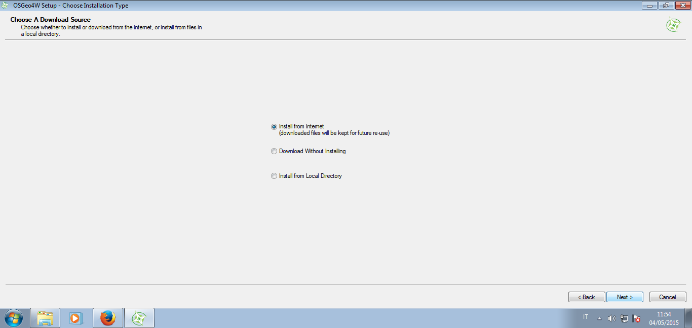
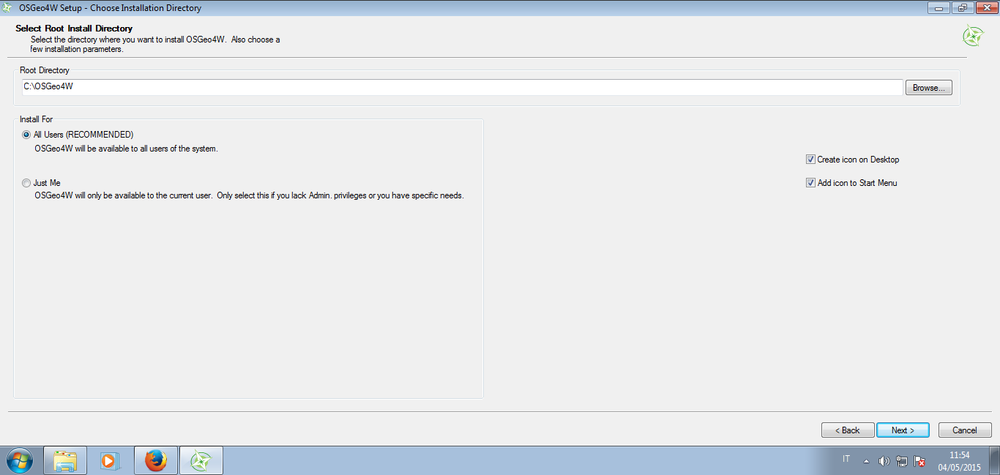
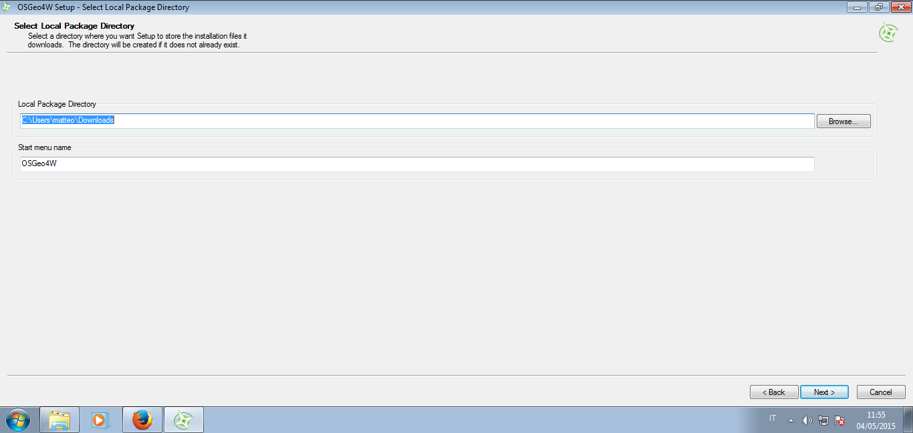
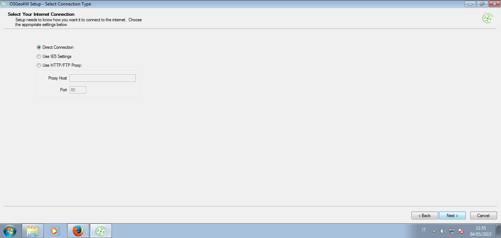
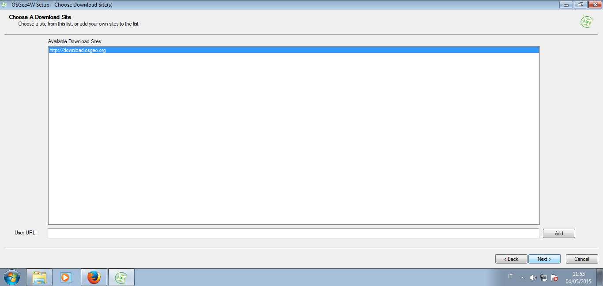
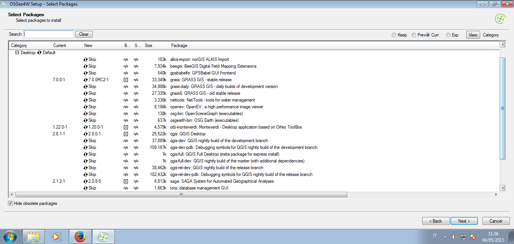
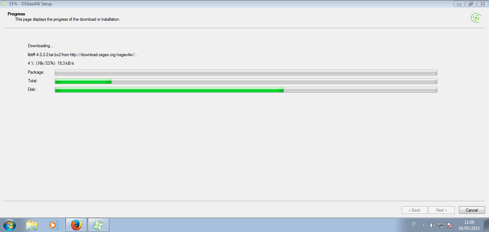
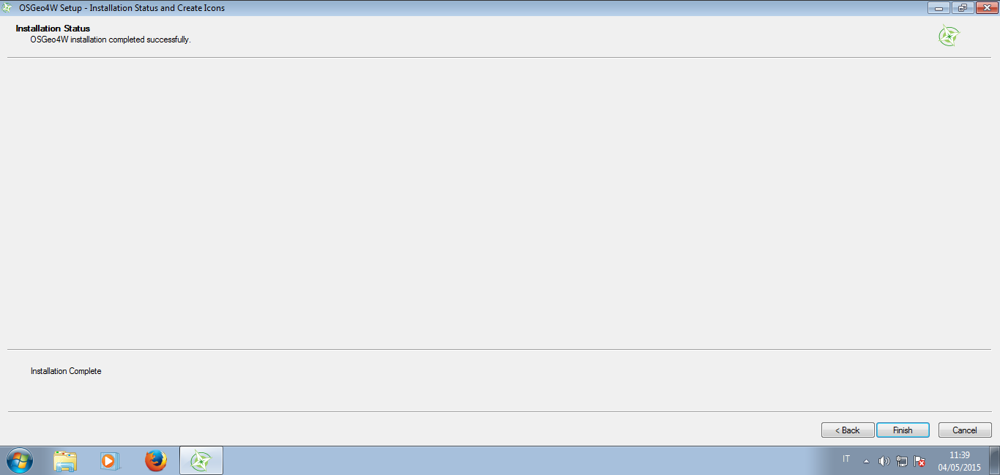

=============
Installazione
=============

QGIS è un software multipiattaforma e facilmente installabile:

Windows
=======
Andare sul `sito <http://qgis.org/it/site/forusers/download.html>`_ e a seconda della versione:

* standalone (installa QGIS e programmi necessari, ma non si può personalizzare). Scelta più rapida ma meno completa
* OSGEO4W permette di personalizzare l'installazione e scaricare anche la versione di sviluppo. In questo modo si possono anche scaricare software di terze parti (SAGA, GRASS, OTB...) e configurali molto semplicemente. Scelta consigliata se si desidera sfruttare QGIS al massimo

Installazione OSGEO4W
---------------------
Breve e rapida guida per scaricare e configurare il pacchetto OSGEO4W:

* scaricare il piccolo file dal `sito <http://qgis.org/it/site/forusers/download.html>`_ scegliendo la versione adatta (32 o 64 bit)
* avviare il file. Si aprorà cosi il *wizard* di installazione:

Mac
===
L'installazione per utenti Mac richiede un po' di pazienza.
Andare sul `sito <http://www.kyngchaos.com/software/qgis>`_ e scaricare QGIS. All'avvio dell'installazione, se dovessero mancare delle dipendenze compariranno dei messaggi di avvertenza.
In questo caso, sempre dalla stessa pagina è necessario cercare i pacchetti mancanti e installarli volta per volta finchè non compaiono più messaggi di errore.
Molto probabilmente la libreria che mancherà è `GDAL <http://www.kyngchaos.com/software/frameworks#gdal_complete>`_.

Linux
=====
Sempre dal `sito <http://qgis.org/it/site/forusers/download.html>`_ scegliere la distribuzione di Linux e aggiungere i repository.
Seguire le istruzioni per l'installazione.

.. warning:: non mescolare i repository per le versioni stabili o di sviluppo!
